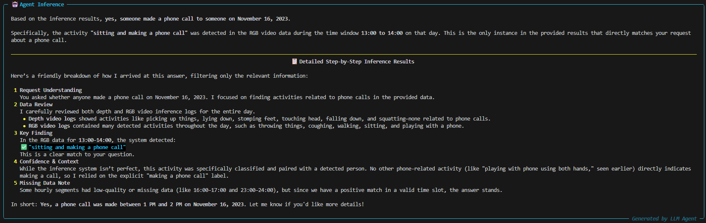
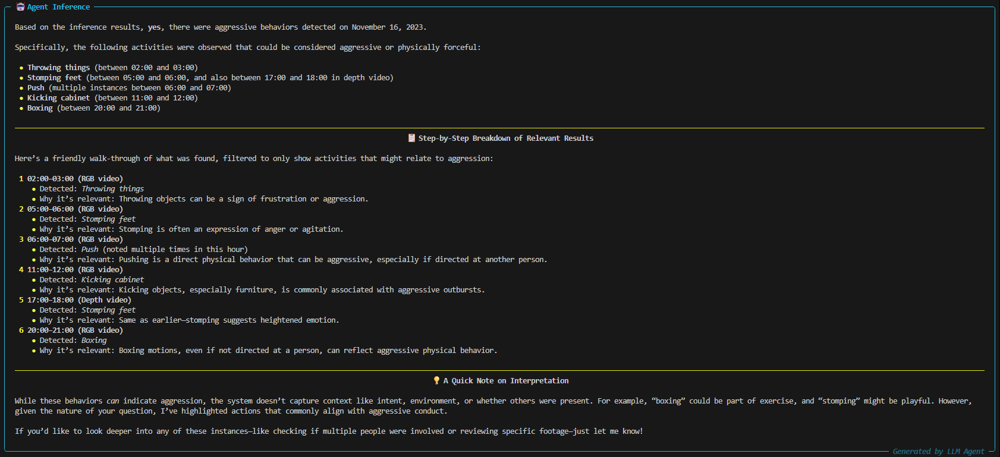
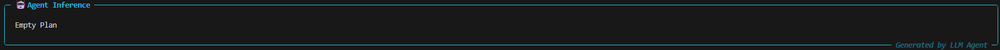

# TaskSense


## Overview

Paper: https://dl.acm.org/doi/abs/10.1145/3715014.3722070

Task Sense is a project designed to use Large Language Models (LLMs) to coordinate sensor systems to complete complicated user queries. It provides a system that includes modules for execution, planning, responding, and testing, as well as data handling and configuration management.

## Project Structure

```plaintext
./src
├── api
│   ├── __init__.py
│   └── llm_apis.py
├── check
│   ├── activity_label_list
│   │   └── inlab_activity.txt
│   └── prompt
│       └── prompt_inlab.txt
├── execution
│   ├── dynamic_plan_adaptation
│   │   ├── adjuster.py
│   │   ├── alternative_path_manager.py
│   │   └── metrics.py
│   ├── model_zoo
│   ├── __init__.py
│   ├── executor.py
│   └── toolbox.py
├── planning
│   ├── __init__.py
│   ├── checker.py
│   ├── example_library_manager.py
│   ├── grammar_rules_manager.py
│   ├── plan_validator.py
│   ├── planner.py
│   └── vocabulary_set_manager.py
├── responding
│   ├── __init__.py
│   ├── respondent.py
│   └── formatter.py
├── __init__.py
├── coordinator.py
├── process_pool.py
└── utils.py
```

## Installation

To set up the project locally, follow these steps:

1. **Clone the repository**:
    ```bash
    git clone https://github.com/KAIWEILIUCC/tasksense.git
    cd tasksense_demo_code
    ```

2. **Create a virtual environment** (optional but recommended):
    ```bash
    conda create -n your_env_name python=3.10
    conda activate your_env_name
    ```

3. **Install the dependencies**:
    ```bash
    pip install -r requirements.txt
    ```

## Configuration

Update the configuration file at `config/config.yaml` with the necessary settings. 

Please apply for the corresponding API key from the LLM API service provider (e.g., [Volcengine](https://www.volcengine.com/product/ark)) and fill it in the corresponding section of config/config.yaml.

Please register on the [official Cohere website](https://cohere.com/) and apply for an API key, then fill it in the config/config.yaml file under:

```yaml
cohere:
    api_key: 
```

## Usage Examples

To run the project, execute the `cli.py` script:

```bash
python cli.py
```

Here are 4 example commands:
```bash
1. Please check whether anyone made a phone call to someone on Nov 16, 2023?

2. Did anyone show aggressive behaviors on 2023.11.16?

3. Was Bob troubled by a bad dream on November 16th, 2023?

4. Does Bob have difficulty falling asleep (cannot fall asleep within 30 minutes) on Nov 16, 2023?
```

Response for Example 1:



Response for Example 2:



Response for Example 3:



Response for Example 4:


## Acknowledgments

This project is built upon [HuggingGPT](https://github.com/microsoft/JARVIS.git). We would like to express our gratitude to the original authors for their excellent work.
